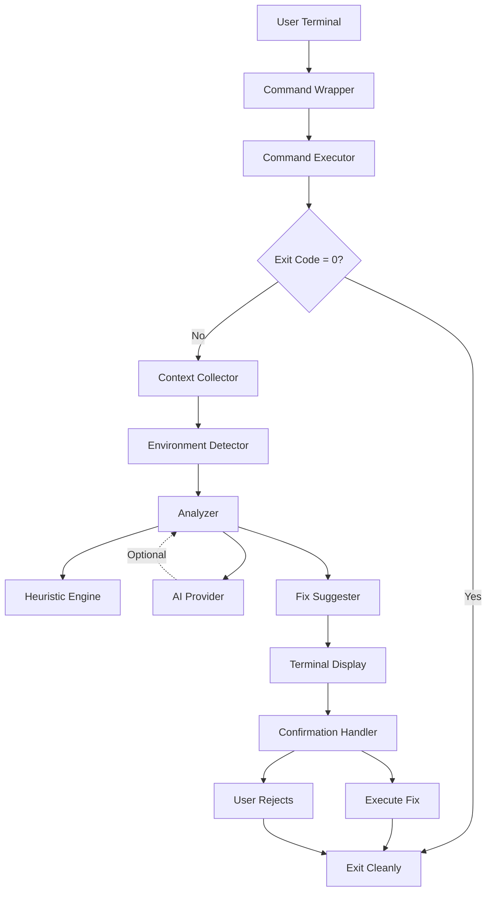

# Design Document: ShellPilot

## Overview

ShellPilot is a CLI-based failure-aware terminal copilot that provides contextual analysis and safe fix suggestions when shell commands fail. The system operates as a command wrapper that executes arbitrary shell commands, detects failures through non-zero exit codes, captures rich execution context, performs root-cause analysis using heuristics and optional AI, and presents actionable fixes that require explicit user confirmation.

The design prioritizes safety, predictability, and minimal performance overhead while maintaining a terminal-only workflow. The system operates with or without AI access through a heuristic fallback mechanism.

## Architecture

### High-Level Architecture



### Component Architecture

The system is organized into six primary components:

1. **Command Wrapper**: Entry point that parses CLI arguments and orchestrates the workflow
2. **Command Executor**: Executes shell commands and captures output/exit codes
3. **Context Collector**: Gathers execution context and environment information
4. **Analyzer**: Performs root-cause analysis using heuristics and optional AI
5. **Fix Suggester**: Generates ranked, risk-labeled fix suggestions
6. **Confirmation Handler**: Manages user interaction and fix execution

### Design Principles

- **Safety First**: No automatic command execution; all fixes require explicit confirmation
- **Fail Gracefully**: Heuristic fallback when AI is unavailable
- **Minimal Overhead**: Fast execution path for successful commands
- **Terminal Native**: All interactions through terminal text interface
- **Stateless**: No persistent storage of user data between sessions
- **Deterministic**: Predictable behavior for identical inputs

## Components and Interfaces

### 1. Command Wrapper

**Responsibility**: CLI entry point and workflow orchestration

**Interface**:
```
function main(args: CommandLineArgs) -> ExitCode
  - Parse command line arguments
  - Validate input
  - Invoke Command Executor
  - Handle success/failure paths
  - Return appropriate exit code
```

**Input**: 
- Command line arguments: `ai-run <command> [args...]`

**Output**:
- Exit code (0 for success, non-zero for failure)
- Terminal output (stdout/stderr passthrough)

**Error Handling**:
- Invalid arguments: Display usage and exit with code 1
- Missing command: Display error and exit with code 1

### 2. Command Executor

**Responsibility**: Execute shell commands and capture results

**Interface**:
```
function execute_command(command: String, shell: Shell) -> ExecutionResult
  - Spawn subprocess with specified shell
  - Stream stdout/stderr to terminal in real-time
  - Capture exit code
  - Return execution result

struct ExecutionResult:
  - command: String
  - exit_code: Integer
  - stderr: String
  - stdout: String (optional, for context)
  - duration: Duration
```

**Implementation Details**:
- Use subprocess spawning with shell interpretation
- Preserve environment variables from parent shell
- Stream output in real-time (no buffering delay)
- Capture stderr separately for analysis
- Measure execution duration

### 3. Context Collector

**Responsibility**: Gather execution context and environment information

**Interface**:
```
function collect_context(result: ExecutionResult) -> ExecutionContext
  - Capture command string
  - Capture exit code and stderr
  - Get current working directory
  - Retrieve recent command history
  - Invoke Environment Detector
  - Structure data for analysis

struct ExecutionContext:
  - command: String
  - exit_code: Integer
  - stderr: String
  - cwd: Path
  - history: List<String>
  - environment: EnvironmentInfo
  - timestamp: DateTime
```

**Environment Detector Sub-Component**:
```
function detect_environment() -> EnvironmentInfo
  - Detect Python version and virtualenv
  - Detect Node.js version
  - Check Docker daemon status
  - Check Git repository status
  - Return best-effort results (partial data acceptable)

struct EnvironmentInfo:
  - python_version: Optional<String>
  - virtualenv_active: Optional<Boolean>
  - virtualenv_path: Optional<Path>
  - nodejs_version: Optional<String>
  - docker_available: Optional<Boolean>
  - git_repo: Optional<Boolean>
  - git_branch: Optional<String>
```

**Implementation Details**:
- Command history: Read from shell history file (last 10 commands)
- Environment detection: Run quick checks with timeouts (200ms each)
- Fail gracefully: Missing environment data is acceptable
- No blocking: Use timeouts for all external checks

### 4. Analyzer

**Responsibility**: Perform root-cause analysis using heuristics and optional AI

**Interface**:
```
function analyze_failure(context: ExecutionContext, config: Config) -> Analysis
  - Run heuristic pattern matching
  - Optionally invoke AI provider
  - Merge results
  - Generate root cause explanation
  - Return analysis

struct Analysis:
  - root_cause: String
  - error_type: ErrorType
  - confidence: Confidence (High, Medium, Low)
  - analysis_method: AnalysisMethod (Heuristic, AI, Hybrid)
  - raw_patterns: List<PatternMatch>
```

**Heuristic Engine Sub-Component**:
```
function match_patterns(context: ExecutionContext) -> List<PatternMatch>
  - Match stderr against known error patterns
  - Check exit code against common codes
  - Apply context-specific rules
  - Return ranked pattern matches

struct PatternMatch:
  - pattern_id: String
  - error_type: ErrorType
  - confidence: Float
  - explanation: String
  - suggested_fixes: List<FixTemplate>

enum ErrorType:
  - PermissionDenied
  - CommandNotFound
  - MissingDependency
  - SyntaxError
  - NetworkError
  - FileNotFound
  - ConfigurationError
  - Unknown
```

**AI Provider Sub-Component**:
```
function invoke_ai(context: ExecutionContext, api_key: String) -> AIAnalysis
  - Structure context as JSON
  - Send request to LLM API
  - Parse structured JSON response
  - Handle timeouts and errors
  - Return analysis or None

struct AIAnalysis:
  - root_cause: String
  - error_type: ErrorType
  - confidence: Float
  - reasoning: String
```

**Implementation Details**:
- Heuristic patterns: Regex-based matching on stderr
- Pattern library: Extensible YAML/JSON configuration
- AI integration: Single LLM provider (OpenAI-compatible API)
- AI timeout: 10 seconds maximum
- Fallback: Always use heuristics if AI fails
- Merge strategy: Prefer AI analysis when confidence > 0.7, otherwise use heuristics

### 5. Fix Suggester

**Responsibility**: Generate ranked, risk-labeled fix suggestions

**Interface**:
```
function suggest_fixes(analysis: Analysis, context: ExecutionContext) -> List<Fix>
  - Generate fixes from analysis
  - Assign risk levels
  - Rank by likelihood of success
  - Limit to top 3 fixes
  - Return ordered list

struct Fix:
  - command: String
  - explanation: String
  - risk_level: RiskLevel
  - reasoning: String (for learning mode)
  - confidence: Float

enum RiskLevel:
  - Low (read-only operations, safe installations)
  - Medium (file modifications, system changes)
```

**Implementation Details**:
- Fix templates: Parameterized command templates from patterns
- Risk classification: Based on command analysis (file writes, sudo, rm, etc.)
- Ranking: Confidence score from analysis + risk penalty
- Limit: Maximum 3 fixes to avoid overwhelming user
- Explanation: Plain English description of what the fix does

### 6. Confirmation Handler

**Responsibility**: Display fixes and manage user confirmation

**Interface**:
```
function handle_confirmation(fixes: List<Fix>, config: Config) -> ConfirmationResult
  - Display analysis and fixes
  - Prompt for user selection
  - Validate input
  - Execute selected fix or exit
  - Return result

struct ConfirmationResult:
  - action: Action (ExecuteFix, Reject)
  - selected_fix: Optional<Fix>
  - execution_result: Optional<ExecutionResult>

function display_fixes(analysis: Analysis, fixes: List<Fix>, learning_mode: Boolean)
  - Print root cause explanation
  - Print numbered fix list with risk labels
  - Include detailed reasoning if learning mode enabled
  - Format with colors and terminal formatting
```

**Terminal Display Format**:
```
❌ Command failed: <command>
Exit code: <code>

🔍 Root Cause:
<explanation>

💡 Suggested Fixes:

1. [LOW RISK] <explanation>
   $ <command>

2. [MEDIUM RISK] <explanation>
   $ <command>

Select a fix (1-3) or press Enter to skip:
```

**Implementation Details**:
- Color coding: Red for errors, yellow for warnings, green for success, blue for info
- Input validation: Accept numbers 1-3 or Enter to skip
- Confirmation: Show exact command before execution
- Learning mode: Add "Why this works:" section for each fix

## Data Models

### Core Data Structures

```
struct CommandLineArgs:
  - command: String
  - args: List<String>
  - shell: Shell (bash or zsh)

struct ExecutionResult:
  - command: String
  - exit_code: Integer
  - stderr: String
  - stdout: String
  - duration: Duration

struct ExecutionContext:
  - command: String
  - exit_code: Integer
  - stderr: String
  - cwd: Path
  - history: List<String>
  - environment: EnvironmentInfo
  - timestamp: DateTime

struct EnvironmentInfo:
  - python_version: Optional<String>
  - virtualenv_active: Optional<Boolean>
  - virtualenv_path: Optional<Path>
  - nodejs_version: Optional<String>
  - docker_available: Optional<Boolean>
  - git_repo: Optional<Boolean>
  - git_branch: Optional<String>

struct Analysis:
  - root_cause: String
  - error_type: ErrorType
  - confidence: Confidence
  - analysis_method: AnalysisMethod
  - raw_patterns: List<PatternMatch>

struct Fix:
  - command: String
  - explanation: String
  - risk_level: RiskLevel
  - reasoning: String
  - confidence: Float

struct Config:
  - ai_enabled: Boolean
  - ai_api_key: Optional<String>
  - ai_endpoint: String
  - learning_mode: Boolean
  - max_fixes: Integer
  - heuristic_patterns_path: Path
```

### Configuration File Format

```yaml
# ~/.shellpilot/config.yaml
ai:
  enabled: true
  api_key: "sk-..."
  endpoint: "https://api.openai.com/v1/chat/completions"
  timeout_seconds: 10

display:
  learning_mode: false
  max_fixes: 3
  color_output: true

heuristics:
  patterns_file: "~/.shellpilot/patterns.yaml"
```

### Heuristic Patterns File Format

```yaml
# patterns.yaml
patterns:
  - id: "permission_denied"
    error_type: "PermissionDenied"
    regex: "Permission denied|EACCES"
    confidence: 0.9
    fixes:
      - command: "sudo {original_command}"
        explanation: "Run with elevated privileges"
        risk: "Medium"
      - command: "chmod +x {target_file}"
        explanation: "Make file executable"
        risk: "Low"

  - id: "command_not_found"
    error_type: "CommandNotFound"
    regex: "command not found|not found in PATH"
    confidence: 0.95
    fixes:
      - command: "which {command_name}"
        explanation: "Check if command is installed"
        risk: "Low"
```

## Correctness Properties


*A property is a characteristic or behavior that should hold true across all valid executions of a system—essentially, a formal statement about what the system should do. Properties serve as the bridge between human-readable specifications and machine-verifiable correctness guarantees.*

### Property Reflection

After analyzing all acceptance criteria, several properties can be consolidated:

- **Context capture properties (3.1-3.6)** can be combined into a single comprehensive property about complete context capture
- **Environment detection properties (4.1-4.5)** can be combined into a property about best-effort detection
- **Fix generation properties (6.2-6.4)** can be combined into a property about well-formed fixes
- **Safety properties (7.3, 12.1)** are identical and should be one property
- **Fallback properties (5.3, 8.4, 13.3)** all test the same behavior and can be combined
- **Display properties (9.2, 9.3)** can be combined into a property about proper formatting

### Core Properties

Property 1: Command execution preserves output
*For any* shell command, when executed through the Command_Wrapper, the stdout and stderr output should be identical to executing the command directly in the shell.
**Validates: Requirements 1.3, 1.4**

Property 2: Exit code capture accuracy
*For any* shell command with a known exit code, the Command_Wrapper should capture the exact exit code returned by the command.
**Validates: Requirements 1.5, 3.2**

Property 3: Failure detection by exit code
*For any* command that exits with a non-zero exit code, the system should classify it as a failure and trigger analysis; for any command with exit code 0, the system should terminate without analysis.
**Validates: Requirements 2.1, 2.2, 2.3**

Property 4: Successful command non-interference
*For any* successful command (exit code 0), wrapping it with the Command_Wrapper should produce identical results and minimal overhead compared to direct execution.
**Validates: Requirements 2.4**

Property 5: Complete context capture
*For any* failed command, the Context_Collector should capture all required context fields: command string, exit code, stderr, current working directory, and command history.
**Validates: Requirements 3.1, 3.2, 3.3, 3.4, 3.5, 3.6**

Property 6: Graceful environment detection
*For any* execution environment, the Environment_Detector should attempt detection of all environment components (Python, Node.js, Docker, Git) and continue successfully even if some detections fail.
**Validates: Requirements 4.1, 4.2, 4.3, 4.4, 4.5, 4.6**

Property 7: Heuristic pattern matching always runs
*For any* failure context, the Analyzer should perform heuristic pattern matching regardless of AI availability.
**Validates: Requirements 5.1, 13.1**

Property 8: AI fallback to heuristics
*For any* failure context, when the AI_Provider is unavailable or times out, the Analyzer should complete analysis using only heuristic results without failing.
**Validates: Requirements 5.3, 8.4, 13.3**

Property 9: Error type classification
*For any* failure context matching a known pattern, the Analyzer should identify the specific error type from the ErrorType enumeration.
**Validates: Requirements 5.5**

Property 10: Fix count constraint
*For any* analysis result, the Fix_Suggester should generate at most 3 fixes.
**Validates: Requirements 6.1**

Property 11: Well-formed fixes
*For any* generated fix, it should have a valid risk level (Low or Medium), a non-empty explanation, and a non-empty command string.
**Validates: Requirements 6.2, 6.3, 6.4**

Property 12: Fix prioritization by confidence
*For any* list of generated fixes, they should be ordered by descending confidence score (highest confidence first).
**Validates: Requirements 6.5**

Property 13: Destructive operation labeling
*For any* fix containing destructive operations (rm, sudo, dd, format, etc.), it should be labeled with at least Medium risk level.
**Validates: Requirements 6.6, 12.2**

Property 14: No execution without confirmation
*For any* suggested fix, the system should never execute it without receiving explicit user confirmation.
**Validates: Requirements 7.3, 12.1**

Property 15: Fix display completeness
*For any* set of suggested fixes, the display output should include all fixes with their risk levels, explanations, and command strings.
**Validates: Requirements 7.1**

Property 16: Command preview before execution
*For any* user-selected fix, the exact command string should be displayed before execution occurs.
**Validates: Requirements 7.4**

Property 17: Confirmed fix execution
*For any* fix that receives user confirmation, the system should execute the exact command string from that fix.
**Validates: Requirements 7.5**

Property 18: Rejection handling
*For any* interaction where the user rejects all fixes, the system should terminate cleanly without executing any commands.
**Validates: Requirements 7.6**

Property 19: Structured AI communication
*For any* AI provider invocation, the request should contain valid JSON with all required context fields, and the response should be parsed as structured JSON.
**Validates: Requirements 8.2, 8.3**

Property 20: Terminal output formatting
*For any* system output, it should use ANSI color codes for different message types and display fixes in a numbered list format (1, 2, 3).
**Validates: Requirements 9.2, 9.3**

Property 21: Terminal width respect
*For any* output text, when the terminal width is known, lines should wrap or truncate to fit within the terminal width.
**Validates: Requirements 9.6**

Property 22: Learning mode detail addition
*For any* fix suggestion, when learning mode is enabled, the output should include additional reasoning content compared to when learning mode is disabled.
**Validates: Requirements 10.1, 10.2, 10.3**

Property 23: Configuration affects behavior
*For any* configuration setting (AI enabled, learning mode, etc.), changing the setting should produce observable changes in system behavior.
**Validates: Requirements 10.4, 14.2, 14.3, 14.4**

Property 24: Non-blocking execution
*For any* command execution, context collection should not block or delay the command from starting.
**Validates: Requirements 11.3**

Property 25: Read-only analysis
*For any* analysis operation, no files or system state should be modified during the analysis phase.
**Validates: Requirements 12.3**

Property 26: Graceful internal error handling
*For any* internal error in ShellPilot components, the system should catch the error, display an error message, and exit gracefully without crashing.
**Validates: Requirements 12.5**

Property 27: Deterministic heuristic analysis
*For any* identical failure context, running heuristic analysis multiple times should produce identical results (same error type, same fixes, same order).
**Validates: Requirements 12.6**

Property 28: Heuristic mode indication
*For any* analysis performed without AI, the output should clearly indicate that heuristic-only mode was used.
**Validates: Requirements 13.4**

Property 29: Pattern extensibility
*For any* valid pattern definition added to the patterns configuration file, the Heuristic_Engine should load and use it for matching.
**Validates: Requirements 13.5**

Property 30: Configuration file loading
*For any* valid configuration file, the system should parse it and apply the settings; for any invalid configuration, the system should display an error and use default values.
**Validates: Requirements 14.1, 14.6**

Property 31: Default configuration fallback
*For any* execution without a configuration file present, the system should operate successfully using built-in default values.
**Validates: Requirements 14.5**

## Error Handling

### Error Categories

1. **User Input Errors**
   - Invalid command syntax
   - Missing required arguments
   - Handling: Display usage message and exit with code 1

2. **Command Execution Errors**
   - Command not found
   - Permission denied
   - Handling: This is the primary use case - trigger analysis workflow

3. **Context Collection Errors**
   - Unable to read command history
   - Unable to detect environment
   - Handling: Continue with partial context (best-effort)

4. **Analysis Errors**
   - AI provider timeout
   - AI provider error response
   - Pattern matching failure
   - Handling: Fall back to heuristics or provide generic analysis

5. **Configuration Errors**
   - Invalid configuration file format
   - Missing required configuration values
   - Handling: Display warning and use default values

6. **Internal Errors**
   - Unexpected exceptions
   - Resource exhaustion
   - Handling: Display error message and exit gracefully

### Error Handling Strategy

- **Fail Gracefully**: Never crash; always provide useful output
- **Best-Effort**: Continue with partial data when full data unavailable
- **Clear Messages**: Display actionable error messages to users
- **Safe Defaults**: Use safe default values when configuration is missing
- **No Silent Failures**: Always log or display errors to the user

### Error Response Format

```
⚠️  ShellPilot Error: <error_type>
<detailed_message>

<suggested_action>
```

## Testing Strategy

### Dual Testing Approach

ShellPilot requires both unit tests and property-based tests for comprehensive coverage:

- **Unit tests**: Verify specific examples, edge cases, and error conditions
- **Property tests**: Verify universal properties across all inputs

Both testing approaches are complementary and necessary. Unit tests catch concrete bugs in specific scenarios, while property tests verify general correctness across a wide range of inputs.

### Property-Based Testing

**Framework**: Use `proptest` (Rust), `Hypothesis` (Python), or `fast-check` (TypeScript/JavaScript) depending on implementation language.

**Configuration**:
- Minimum 100 iterations per property test
- Each test must reference its design document property
- Tag format: `Feature: shellpilot, Property {number}: {property_text}`

**Property Test Coverage**:
- Command execution and output preservation (Properties 1-4)
- Context capture completeness (Property 5)
- Environment detection resilience (Property 6)
- Analysis fallback behavior (Properties 7-9)
- Fix generation constraints (Properties 10-13)
- Safety guarantees (Properties 14, 25)
- User interaction flow (Properties 15-18)
- Configuration behavior (Properties 23, 30-31)
- Determinism (Property 27)

**Example Property Test Structure**:
```rust
// Feature: shellpilot, Property 2: Exit code capture accuracy
#[test]
fn prop_exit_code_capture() {
    proptest!(|(exit_code in 0..255u8)| {
        let result = execute_command(&format!("exit {}", exit_code));
        assert_eq!(result.exit_code, exit_code);
    });
}
```

### Unit Testing

**Focus Areas**:
- Specific error pattern matching (e.g., "Permission denied" → PermissionDenied)
- Configuration file parsing with various formats
- Terminal output formatting with specific inputs
- Risk level classification for known destructive commands
- Edge cases: empty stderr, very long command strings, special characters

**Example Unit Test**:
```rust
#[test]
fn test_permission_denied_pattern() {
    let stderr = "bash: ./script.sh: Permission denied";
    let matches = heuristic_engine.match_patterns(stderr);
    assert_eq!(matches[0].error_type, ErrorType::PermissionDenied);
}
```

### Integration Testing

**Scenarios**:
- End-to-end workflow: command execution → failure → analysis → fix suggestion → confirmation
- AI provider integration with mock responses
- Configuration loading and application
- Multi-step fix execution

### Test Data Strategy

**Generators for Property Tests**:
- Random shell commands (valid syntax)
- Random exit codes (0-255)
- Random stderr content (with and without known patterns)
- Random environment configurations
- Random fix suggestions with varying risk levels

**Fixtures for Unit Tests**:
- Known error messages from common tools (npm, pip, docker, git)
- Sample configuration files (valid and invalid)
- Sample command histories
- Sample environment detection outputs

### Testing Safety Properties

Safety properties (no execution without confirmation, read-only analysis) require special attention:

- **Mock user input**: Simulate user confirmation/rejection
- **File system monitoring**: Verify no writes during analysis
- **Command execution tracking**: Verify commands only execute after confirmation
- **Subprocess monitoring**: Verify no unexpected subprocess spawns

### Performance Testing

While not property-based, performance requirements should be validated:

- Successful command overhead: < 50ms
- Heuristic analysis time: < 5 seconds
- AI provider timeout: 10 seconds
- Environment detection: < 2 seconds

Use benchmarking tools appropriate to the implementation language.
